# Hough Transform
  The Hough transform is a feature extraction technique used in image analysis, computer vision, and digital image processing. The purpose of the technique is to find imperfect instances of objects within a certain class of shapes by a voting procedure. This voting procedure is carried out in a parameter space, from which object candidates are obtained as local maxima in a so-called accumulator space that is explicitly constructed by the algorithm for computing the Hough transform.

##  Traffic Light Detection
  The function traffic_light_detection(img, radii_range) detects a traffic light from a simulated traffic light image in a scene. The lights are red, yellow, and green stacked vertically with no occlusion of the traffic light. This function determines the state of each traffic light and position in a scene. The position is measurd from the center of the traffic light. As this image presents symmetry, the position of the traffic light matches the center of the yellow circle.
  
  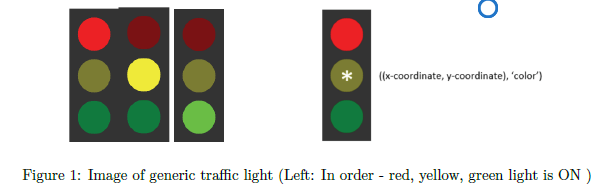
  
  * Testing:  A trafficc light scene that we will test is randomly generated. 
    * Functional assumptions: A basic color scheme is used, but the scene may have different color objects and backgrounds. The shape of the traffc light is not changed, nor is the size of the individual lights relative to the traffic light. Size range of the lights can be reasonably expected to be between 10-30 pixels in radius. There will only be one traffc light per scene, but its size and location is generated at random. While the traffic light is not occluded, the objects in the background may be.
    
  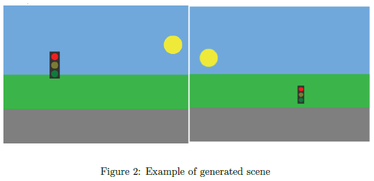
  
  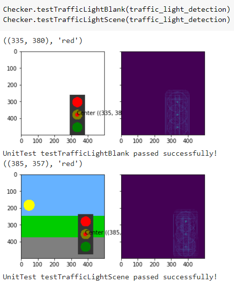
  
##  Traffic Sign Detection (one per scene)
  Below are 5 common road signs that you would see in the United States.
  
  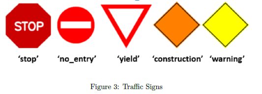
  
  * Similar to the traffic light, the goal here is to detect the sign in a scene and finding the (x, y) i.e (col, row) coordinates that represent the polygon's centroid.
    * Functional assumptions: Like above, assume that the scene may have different color objects and backgrounds. The size and location of the traffic sign is generated at random. While the traffic signs is not occluded, objects in the background may be.
    
  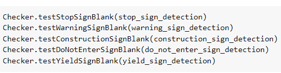
  
  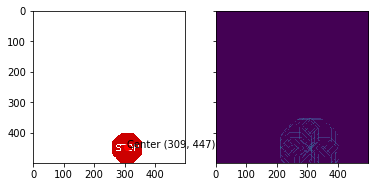
  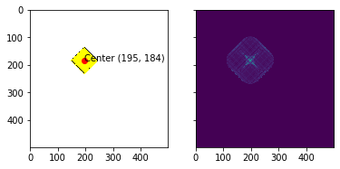
  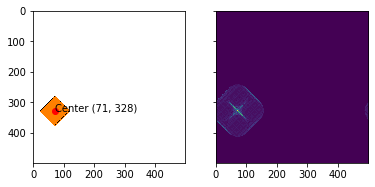
  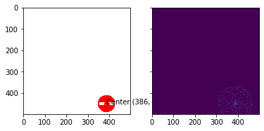
  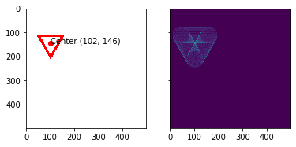
  
##  Traffic Sign Detection (multiple per scene)
  The goal is to detect multiple traffic signs and the traffic light in one scene. Like above, the scene may have different color objects and backgrounds. There are n instances of each sign and/or traffic light, where n is 0 or 1. The size and location of each is generated at random. While the traffic signs are not occluded, objects in the background may be.
  
  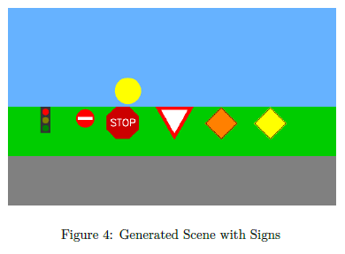
  
  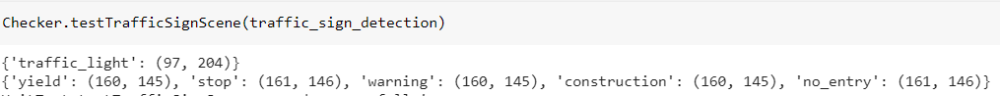
  
  
